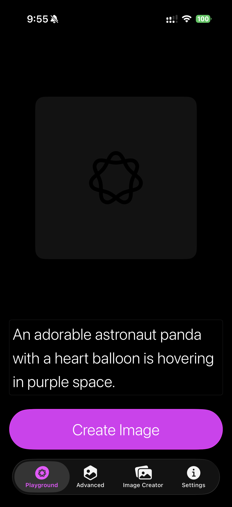
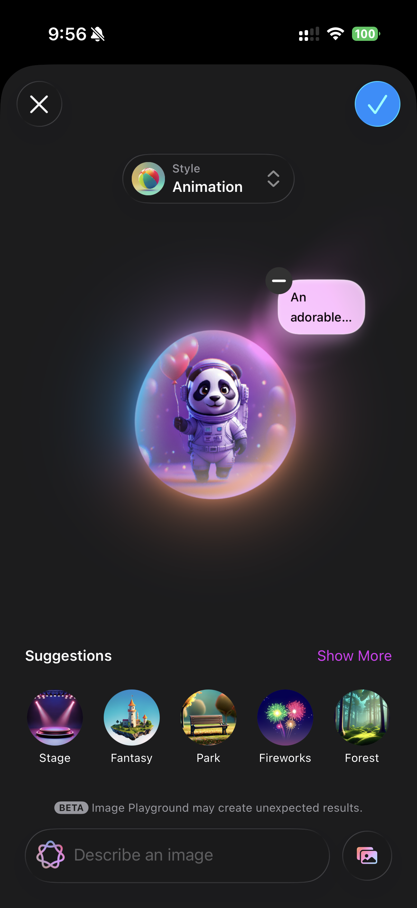
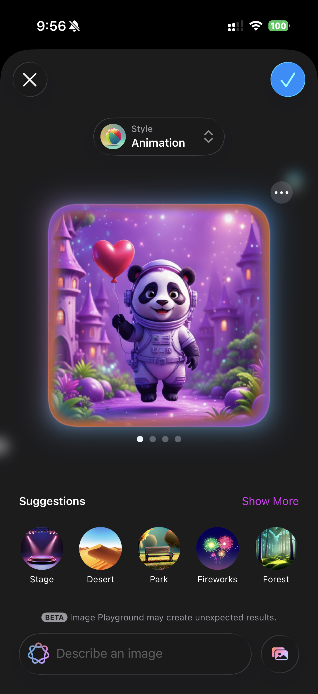
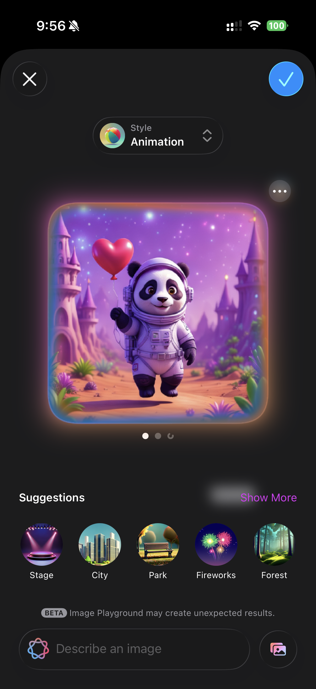

# ✨ Pixie AI

Pixie AI is a modern SwiftUI application that showcases Apple's on-device AI capabilities using Image Playground and Apple Intelligence.

The app allows users to generate beautiful AI-powered images with different visual styles and interactive experiences.

---

## 🚀 Features

- 🎨 AI Image Generation
- 🐼 Animated Playground Styles
- 🌌 Multiple Theme Suggestions
- 📱 Modern SwiftUI Interface
- 🔊 Sound Toggle Support
- 🧠 Apple Intelligence Integration
- 💾 Share & Save Generated Images

---

## 🛠️ Built With

- SwiftUI
- Apple Intelligence
- Image Playground
- Xcode
- iOS

---

## 📸 Screenshots

### Home Screen

---

### Image Generation

---

### AI Generated Results

---

### Settings Screen

---

## 📂 Repository

🔗 GitHub Repo:  
https://github.com/DhruvPatel05/Pixie

---

## 👨‍💻 Author

Dhruv Patel

- LinkedIn: https://www.linkedin.com/in/dhruv-patel-csm/
- GitHub: https://github.com/DhruvPatel05
